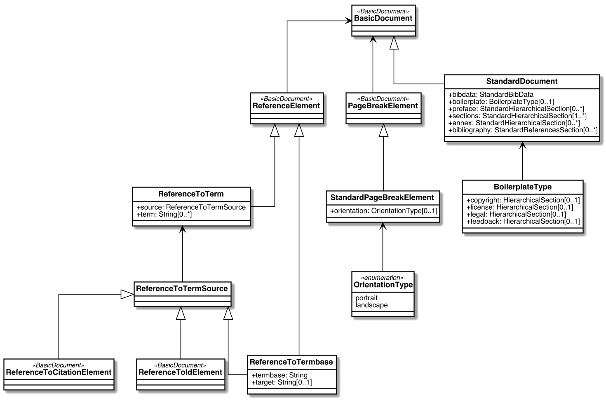
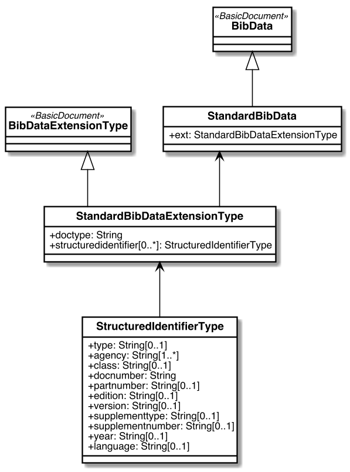
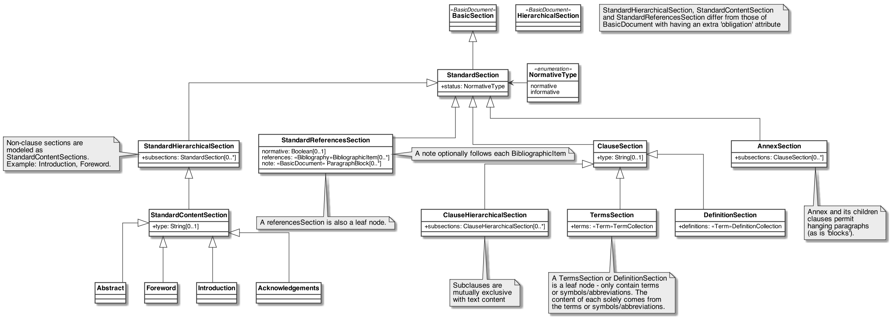
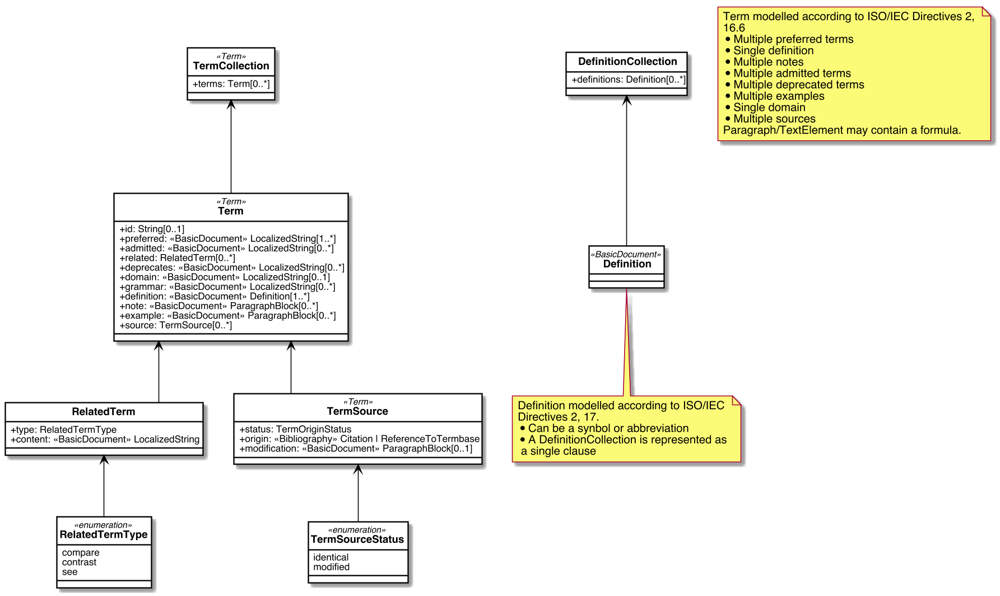
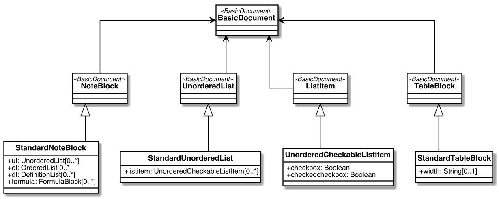
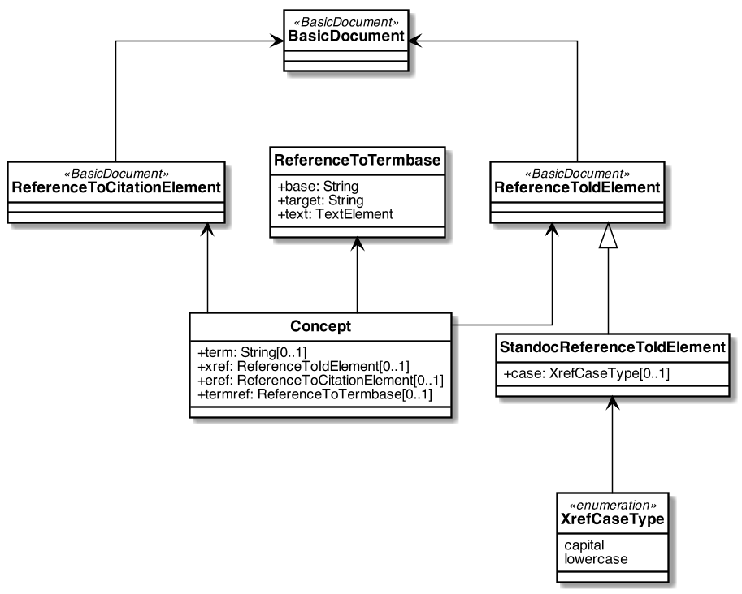

= TradeDocs StandardDocument Models

TradeDocs `StandardDocument` (abbreviated as `StanDoc`)
is a family of document models that forms the basis
of TradeDocs `IsoDoc`, which is used to represent ISO Standards and
similarly structured standards.

The Relaton Bibliography UML models used within these models are located here:
https://github.com/metanorma/relaton-models[Relaton BibModels]

== Standard Document UML Models

=== StandardDocument

=== Metadata

=== Sections

=== Terms

=== Blocks

=== Inline

